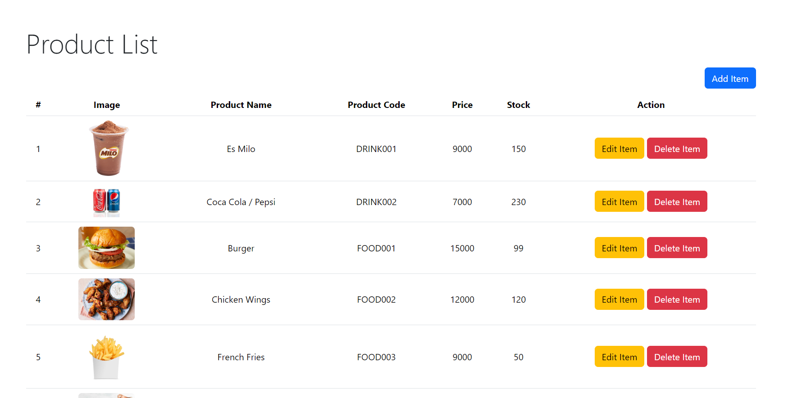
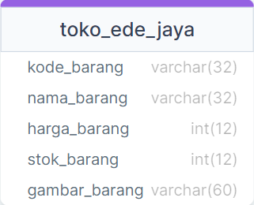

# CRUD dengan PHP Native, MySQL, dan Bootstrap 5

## Tugas MG07 - Manajemen Stok Fast Food

## Skema Basis Data

File basis data sampel dapat ditemukan 

### Pendahuluan

Dokumentasi ini menjelaskan implementasi CRUD (Create, Read, Update, Delete) menggunakan PHP Native, MySQL, dan Bootstrap 5 dalam konteks manajemen stok Fast Food. Tujuan dari tugas ini adalah untuk memberikan panduan penggunaan aplikasi ini.

### Fitur Aplikasi

Aplikasi ini memiliki beberapa fitur utama:

1. **Menampilkan Daftar Produk:** Aplikasi ini memungkinkan pengguna untuk melihat daftar produk Fast Food yang tersedia, termasuk informasi seperti nama produk, kode produk, harga, stok, dan gambar produk.

2. **Menambahkan Produk:** Pengguna dapat menambahkan produk baru dengan mengisi informasi seperti kode produk, nama produk, harga, stok, dan URL gambar produk.

3. **Mengedit Produk:** Aplikasi memungkinkan pengguna untuk mengedit informasi produk yang ada, termasuk nama produk, harga, stok, dan URL gambar produk.

4. **Menghapus Produk:** Pengguna dapat menghapus produk yang tidak diperlukan lagi.

### Panduan Penggunaan

Berikut adalah panduan penggunaan aplikasi ini:

#### Menampilkan Daftar Produk
1. Jalankan aplikasi index.php dengan XAMPP atau dengan VSCode Extension: PHP Serve

2. Buka aplikasi di browser Anda dengan mengakses URL http://localhost:3000/wad-mg07/index.php.

3. Anda akan melihat daftar produk Fast Food yang tersedia, termasuk informasi seperti nama produk, kode produk, harga, stok, dan gambar produk.

#### Menambahkan Produk Baru

1. Klik tombol "Add Item" yang ada di atas daftar produk.

2. Anda akan melihat jendela pop-up yang memungkinkan Anda untuk menambahkan produk baru. Isi informasi seperti kode produk, nama produk, harga, stok, dan URL gambar produk.

3. Klik tombol "Add Item" untuk menyimpan produk baru.

#### Mengedit Produk

1. Di daftar produk, temukan produk yang ingin Anda edit.

2. Klik tombol "Edit Item" yang sesuai dengan produk tersebut.

3. Anda akan melihat jendela pop-up yang memungkinkan Anda untuk mengedit informasi produk. Anda dapat mengubah nama produk, harga, stok, dan URL gambar produk.

4. Klik tombol "Edit Item" untuk menyimpan perubahan.

#### Menghapus Produk

1. Di daftar produk, temukan produk yang ingin Anda hapus.

2. Klik tombol "Delete Item" yang sesuai dengan produk tersebut.

3. Anda akan melihat konfirmasi penghapusan. Klik tombol "Delete Item" untuk menghapus produk.

### Catatan

Pastikan Anda telah menjalankan server web lokal (seperti XAMPP atau WAMP) dan mengimpor basis data dari file SQL yang disediakan sebelum menggunakan aplikasi ini.

Dengan mengikuti panduan ini, Anda akan dapat mengelola stok produk Fast Food dengan mudah menggunakan aplikasi CRUD sederhana ini.

Terima kasih!
